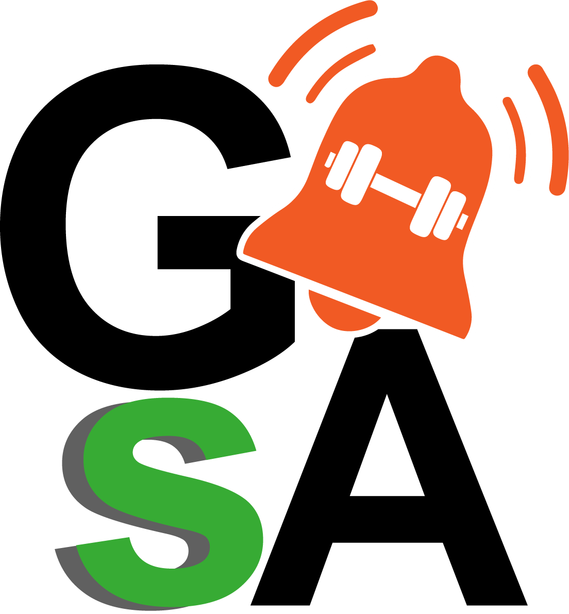

# Sistema de información para el gimnasio del CEET _GymSenApp_

<!--  -->
<!-- {width='40px'} -->

<!-- {width=40px height=40px} -->

> **Tu gimnasio sena al alcance de tus manos**

# Documentación importante

Aquí te presentamos lo que debes saber sobre nuestro proyecto
Esperamos que sea de tu agrado y le puedas sacar el máximo provecho.

## Objetivos

### General
Desarrollar un sistema de información web para el CEET del SENA, con el fin de optimizar los procesos que engloba el uso del gimnasio del centro, permitiendo así una mejor planificación de las rutinas de ejercicios de los aprendices, así como también permitirá apoyar el acompañamiento y comunicación por parte del personal del gimnasio, hacia los aprendices que asistan al lugar.​

### Específicos
- #### Del proyecto
	- `Recolectar la información requerida` para darle contexto y fuerza al ​sistema (enfocada a la necesidad de crear el sistema de información), ​esto mediante encuestas.​
	-   `Analizar los resultados` de la información recolectada mediante las ​encuestas realizadas.​
	-   `Validar la información analizada y las conclusiones generadas` mediante conversaciones con los stakeholders del proyecto con el ​objetivo de concretar ideas y sentar las bases del proyecto.​
	-   `Diseñar propuesta del sistema de información` que integre lo que se ​planea, desarrolle el software.​
	 -  `Desarrollar el sistema` que permita la complementación de los procesos que desarrollen los aprendices dentro del gimnasio ​(actividades a desarrollar, sistema de comunicación de novedades, ​sistema de comunicación hábitos complementarios, etc.)
	-   `Realizar pruebas de funcionalidad` al sistema de información propuesto.​
	-   `Implementar` el sistema en el CEET (en la medida de lo posible).​

- #### Del sistema
	-   Permitir que el usuario (aprendiz) esté informado sobre los cambios y/o situaciones que se efectúen en el gimnasio a través de `anuncios`. 
	-   Crear un espacio en el que los aprendices puedan informarse sobre​ `complementos a sus rutinas de ejercicios` con el fin de que obtengan mejores resultados con las actividades que desarrollen dentro del establecimiento.​
	-   Brindar un espacio en donde el aprendiz se pueda `registrar dentro del ​sistema`, así como pueda ingresar los datos médicos necesarios.​
	- Brindar un espacio de `cuenta propia` (teniendo en cuenta haberse registrado), para así acceder a funcionalidades especiales, a la vez que ​se facilita el control de las personas que tienen acceso al gimnasio.​
	- Crear un espacio en donde los aprendices podrán ver `opciones de ejercicios que puedan hacer por músculo`, contribuyendo a su aprovechamiento de las instalaciones del gimnasio.​
	- Generar un espacio que le brinde al personal encargado del gimnasio, una forma más fácil de hacer `seguimiento a los aprendices` que desarrollan actividades en el establecimiento.​

## Pregunta problema

¿Cómo ayudar al aprovechamiento de los espacios del gimnasio del CEET, teniendo en cuenta brindarles información oportuna a los aprendices, ayudarlos a que planifiquen mejor lo que desarrollarán en el lugar, así como brindarle al personal indicado la ayuda necesaria para que se les faciliten las tareas que deban cumplir para controlar correctamente el uso de las instalaciones?​

## Planteamiento del problema

**El problema radica en tres puntos:​**
- _Desinformación de los aprendices_
- _Poca preparación para desarrollar rutinas de ejercicio claras y organizadas_
- _Poca efectividad en los procesos de control de asistencia a las instalaciones_

Pequeños problemas que desencadenan el **poco aprovechamiento de las instalaciones** del gimnasio del centro, el cual es un recurso fenomenal para lograr la **formación profesional integral** de los aprendices.​

## Alcance del proyecto

El sistema les facilitará a los clientes del gimnasio del CEET, el acceso a una plataforma en la que podrán gestionar lo referente al mismo, su estadía allí y lo que a su salud física corresponde. ​

En ese sentido, el programa brindará:
-   _Apartado de anuncios del gimnasio_
-   _Apartado consejos adicionales_
-   _Acceso a una cuenta propia (privada)_
-   _Espacio con recomendaciones de máquinas y/o ejercicios a desarrollar según requerimientos del cliente_
-   _Espacio para registrar asistencia de aprendices_
    
Se desarrollará dentro de los límites establecidos por el programa de formación (7 trimestres más o menos).​

## Justificación​

El proyecto encuentra la problemática anteriormente planteada, como una situación relevante a solucionar con el objetivo de que se logren apoyar los procesos que desarrolla el gimnasio, a la vez que es una adecuada forma de brindarle a los clientes información relevante sobre el establecimiento, de forma efectiva, clara y oportuna.​